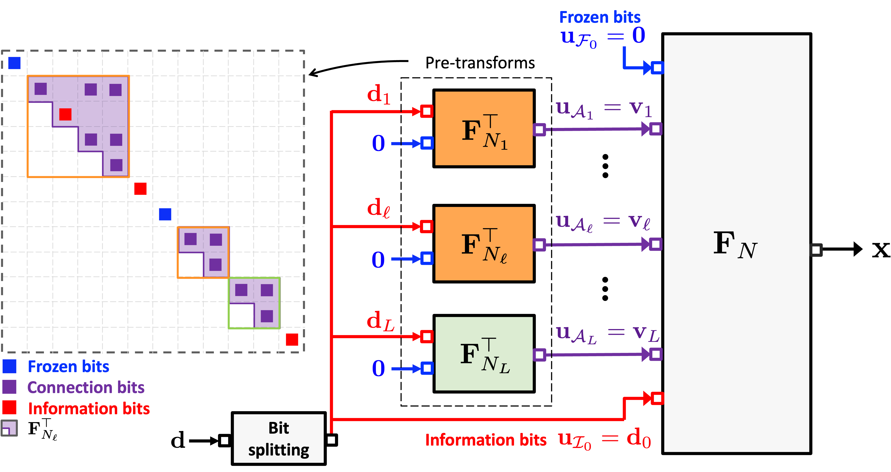
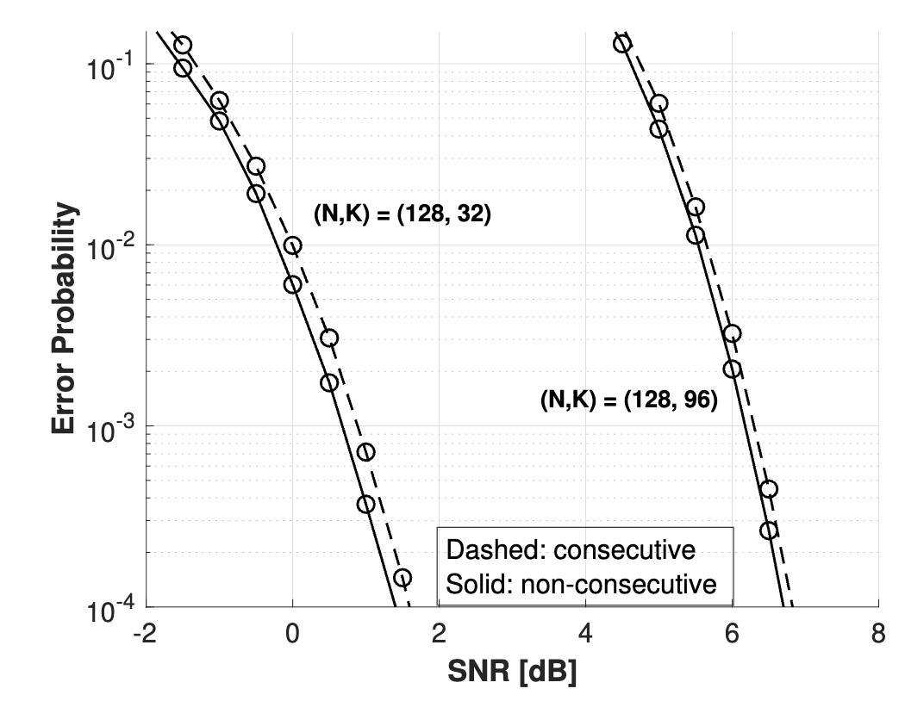
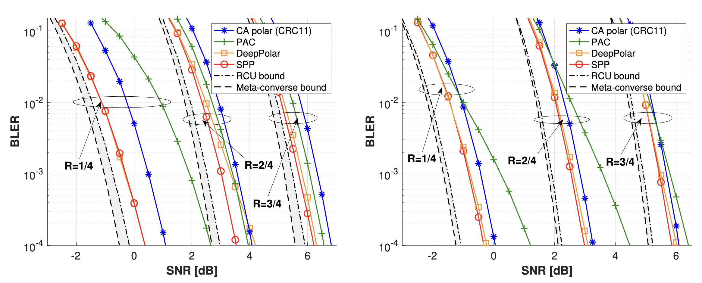

# Work in progress

# Polar Codes and Advanced Coding Techniques

[← Back to Research](/research/)

## Overview

Polar codes represent a fundamental breakthrough in channel coding theory, being the first provably capacity-achieving codes with explicit construction. My research addresses the practical challenges of polar codes in next-generation wireless systems, developing advanced techniques for URLLC, short packet transmission, and flexible deployment scenarios.

### Channel Polarization Phenomenon

Polar codes exploit the remarkable channel polarization phenomenon discovered by Arıkan in 2009. Through recursive channel combining and splitting operations, a set of N synthetic channels becomes either nearly perfect or nearly useless:

$$W_N^{(i)}: \mathcal{X} \to \mathcal{Y}^N \times \mathcal{X}^{i-1}$$

*Figure 1: Polar code construction and channel polarization phenomenon.*
<!-- 
**Key Properties**:
- **Capacity Achievement**: Polar codes achieve the symmetric capacity I(W) of the underlying channel
- **Explicit Construction**: No random codes needed - completely deterministic construction
- **Low Complexity**: Encoding and decoding complexity of O(N log N)
- **Recursive Structure**: Natural binary tree structure enabling efficient processing -->

### Successive Cancellation (SC) Decoding

The basic SC decoder processes bits sequentially, making hard decisions at each step:

$$\hat{u}_i = \begin{cases}
0 & \text{if } i \in \mathcal{F} \\
\arg\max_{u_i} W_N^{(i)}(y_1^N, \hat{u}_1^{i-1} | u_i) & \text{if } i \in \mathcal{I}
\end{cases}$$
where $\mathcal{F}$ is the frozen set and $\mathcal{I}$ is the information set.

*Figure 2: Successive cancellation decoding.*

The SC list (SCL) decoder maintains upto $L$ decoding paths to improve the decoding performance.

## Practical Challenges and Solutions

Polar codes face two fundamental challenges in practical deployment: finite-blocklength performance and blocklength constraints (natural construction for $N = 2^n$ only). My research develops targeted solutions addressing these specific limitations.

### Challenge 1: Finite-Length Performance

While polar codes are asymptotically capacity-achieving, their finite-length performance, especially for short packets, requires enhancement through advanced techniques.

Understanding and addressing specific error mechanisms in SCL decoding is crucial for optimal performance.

**Type I Error $(\epsilon_1)$ - Path Elimination**:
- Correct path eliminated from decoding candidate list
- Dominates at low SNR and small list size
- Addressed by SPP codes

**Type II Error $(\epsilon_2)$ - Incorrect Selection**:
- Wrong path selected from remaining candidates
- Dominates at high SNR and large list size due to minimum distance
- Addressed by deep polar codes

*Figure 3: Two types of error event of SCL decoder.*

#### Deep Polar Codes: Multi-Layer Concatenation

**Problem Addressed**: Type II errors (incorrect codeword selection) in SCL decoding by reducing the number of low-weight codewords.

*Figure 4: Deep polar codes multi-layer architecture addressing Type II errors.*

**Technical Innovation**:
- **Serially Concatenated Structure**: Multiple layers with optimized rate allocation
- **Weight Distribution Enhancement**: Improved minimum distance properties
- **SCL Decoding Enhancement**: Effective increase in list size without proportional complexity

*Figure 5: Decoding performance comparison across different techniques and scenarios (BEC channel).*

#### Sparsely Pre-transformed Polar (SPP) Codes

**Problem Addressed**: Type I errors (correct codeword elimination) in SCL decoding by limiting the number of consecutive (semi-polarized) information bits.

*Figure 6: SPP codes preventing correct path elimination through pre-transformation.*

**Technical Innovation**:
- **Pre-transformation Matrix**: Strategic bit reordering to prevent path elimination
- **Information Bit Constraint**: Consecutive information bits are separated
- **Frozen Bit Insertion**: Low-reliability positions filled strategically
- **Path Preservation**: Maintains correct paths in small list sizes

*Figure 7: The effect of consecutive semi-polarized information bits.*

*Figure 8: Decoding performance comparison across different techniques and scenarios (AWGN channel).*

### Challenge 2: Blocklength Flexibility
Polar codes naturally support blocklengths $N = 2^n$ only.
In 5G NR, the following methods are available for supporting arbitrary blocklengths.

The inherent constraint of Arıkan's construction limits polar code lengths to powers of two, i.e., $M = 2^n$. To support arbitrary codeword lengths $M \neq 2^n$, rate-matching techniques are employed:
- **Shortening and Puncturing:** Used to reduce code length from a larger mother code of size $N > M$. 
- **Extension and Repetition:** Used to increase code length from a smaller mother code of size $N < M$.

In 5G NR systems, quasi-uniform puncturing and shortening with sub-block interleaving are employed for rate-matching, ensuring compatibility while maintaining good performance \cite{3gpp-nr-coding}. Shortening removes the last $N-M$ interleaved codeword bits, while puncturing removes the first $N-M$ bits. Repetition extends the first $M-N$ interleaved codeword bits.

**Our extension** 

Simulation Results

*Figure 10: Comprehensive performance comparison across different techniques and scenarios*

### Challenge 3: Non-Coherent Transmission

**Motivation**: Short packet scenarios suffer from significant pilot overhead

**Technical Approach**:
- Block-fading channels without CSI
- Code-splitting techniques
- Joint detection and decoding

*Figure 8: Non-coherent polar-coded communication system*

<!-- **Key Innovations**:
- Information-theoretic analysis of capacity limits
- Practical decoder with reasonable complexity
- Performance analysis under various fading conditions -->

Simulation Results

*Figure 10: Comprehensive performance comparison across different techniques and scenarios*

## Conclusion

Polar codes represent a paradigm shift in channel coding, offering provable capacity achievement with practical implementability. My research addresses the key challenges preventing widespread deployment, developing targeted solutions for error mitigation, blocklength flexibility, and performance optimization.

The integration of advanced techniques - deep polar codes, SPP codes, and sophisticated rate-matching - creates a comprehensive framework for next-generation wireless systems. These innovations enable polar codes to meet the stringent requirements of URLLC, support diverse applications from IoT to holographic communications, and provide the foundation for 6G wireless networks.

---

## Related Publications
1. **G. Choi** and N. Lee, "[Deep Polar Codes](https://ieeexplore.ieee.org/abstract/document/10462164)," in *IEEE Transactions on Communications*, vol. 72, no. 7, pp. 3842-3855, July 2024
2. **G. Choi** and N. Lee, "[Sparsely Pre-transformed Polar Codes for Low-Latency SCL Decoding](https://ieeexplore.ieee.org/abstract/document/10945422)," in *IEEE Transactions on Communications* (early access)
3.  **G. Choi** and N. Lee, "[Rate-Matching Deep Polar Codes via Polar Coded Extension](https://arxiv.org/abs/2505.06867)," submitted to TCOM.

**Contact**: [geon.choi@postech.ac.kr](mailto:geon.choi@postech.ac.kr)

---

[← Back to Research](/research/)